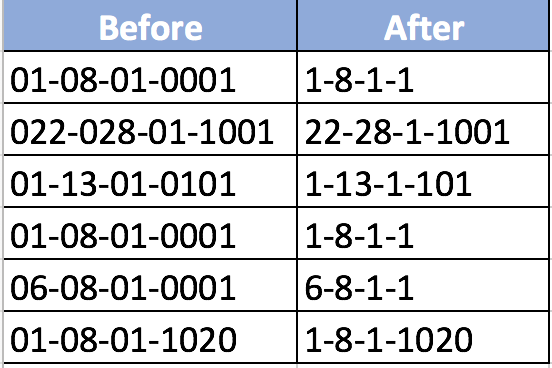

# Exercise -1-
In the first exercise I answered a question from an Israeli VBA Facebook group.  

The mission was to make a macro function that can remove unwanted zeros in a String.

For example:

